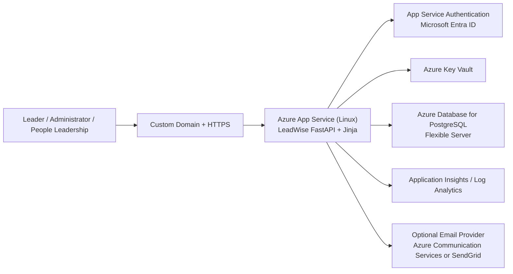

# LeadWise Production Architecture

## Recommended Azure architecture

LeadWise is best deployed as a web-first FastAPI application on Azure App Service, backed by managed identity, Microsoft Entra sign-in, and a production database.

## Why this architecture fits LeadWise

- App Service is a natural fit for the existing FastAPI and server-rendered template stack.
- Microsoft Entra sign-in aligns with the future SSO requirement and company-managed access.
- PostgreSQL Flexible Server is the right long-term store for users, threads, notes, feedback, ratings, and workflow state.
- Key Vault keeps secrets out of code and out of app settings where possible.
- Application Insights gives operational visibility for page errors, performance issues, and failed workflows.

## Recommended production components

### 1. Web application

- Azure App Service on Linux
- Python runtime
- Startup command using Gunicorn + Uvicorn workers
- Custom domain and HTTPS only
- Staging slot for safe releases

### 2. Authentication and access

- Microsoft Entra ID via App Service Authentication
- Restrict sign-in to your organization
- Use Entra groups or claims mapping for:
  - `Leader`
  - `Administrator`
  - `People Leadership`

### 3. Data layer

- Move away from local JSON persistence for production
- Use Azure Database for PostgreSQL Flexible Server
- Create tables for:
  - users and roles
  - topic access
  - notes and reflections
  - feedback and ratings
  - questions and topic suggestions
  - community threads, replies, likes, follows
  - queued notifications

### 4. Secrets and configuration

- Store app secrets in Azure Key Vault
- Reference secrets from App Service
- Keep non-secret configuration in App Service application settings

### 5. Observability

- Application Insights
- App Service log streaming
- Alerting for:
  - app downtime
  - repeated failed requests
  - failed notification processing

## Current production readiness status

### Already in place

- FastAPI application structure
- shared route and template model
- environment-variable-friendly config
- production startup script
- switchable storage backend that can use PostgreSQL through `DATABASE_URL`
- role-oriented app flow

### Still required before production go-live

- replace JSON store with PostgreSQL-backed persistence
- implement real SSO user resolution from Entra claims
- enforce role-based access from identity instead of demo users
- wire real outbound email delivery
- add CI/CD and deployment automation

## Deployment target recommendation

Use Azure App Service + Azure Database for PostgreSQL as the first production target.

This is the best balance of:

- speed to production
- fit with the current codebase
- future Teams integration readiness
- operational simplicity for an internal business application
